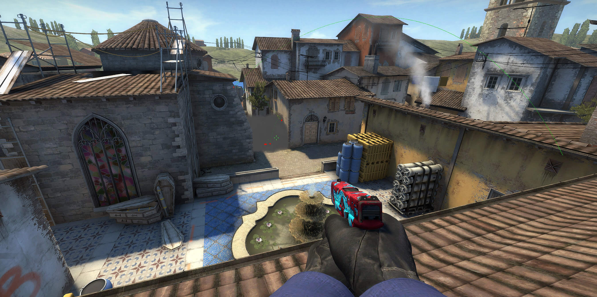

# Content

This tutorial will cover the following areas:

* [1. The basic](#basics)
* [2. The coffin smoke](#coffin)
* [3. The CT smoke](#ct)

## 1. The basics

When you take Inferno B-site there two places, you want to smoke in a site. The coffin and the CT spawn, if you can smoke two of those your life will be much easier on the site. In this article, we will go through how these easy smokes are thrown.

## 2. The coffin smoke

Make sure you are in control of the banana before start smoking these. Let your teammates know what are you smoking and when you are smoking. The communication is the key here.

First, align yourself with the pile of woods and run to them.

Turn your face on B-site and aim at a knob of the fence on your left under the wires.

Start aim higher until your crosshair crosses another knob. Now your crosshair will be aligned with the knob you start from and another knob.

Press mouse 1 and the coffin will be smoked perfectly. Have fun in B-site.

Gif of the Coffing smoke

## The CT smoke

Lorem ipsum dolor sit amet, consectetur adipiscing elit. Phasellus ultrices a urna non pharetra. Utadawdasd lobortis neque et sapien eleifend, non suscipit elit posuere. Fusce eget porta tortor, nec mattis nibh. Nulla ligula tortor, tempor quis enim in, commodo gravida nibh. Aenean sodales aliquam nisl, non sollicitudin urna tristique a. Sed vulputate ante a augue tempus bibendum non eget diam.
