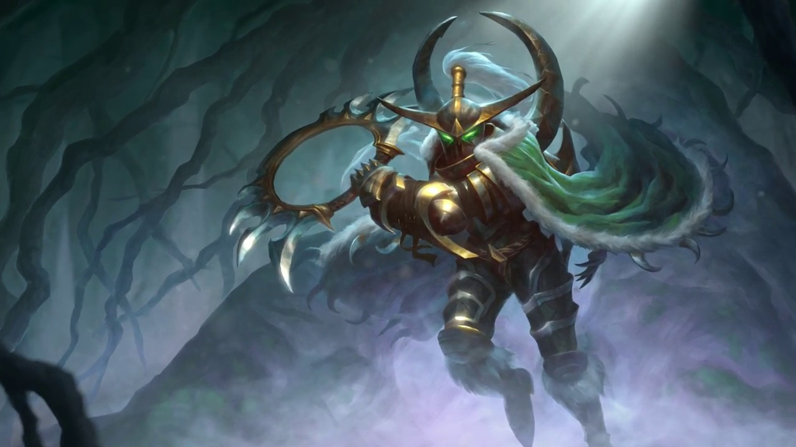

# Content

This tutorial will cover the following areas:

* [1. The basics](#basics)
* [2. Talents](#talents)
* [3. How to lane push effectively](#how-to-push)

## 1. The basics

Lorem ipsum dolor sit amet, consectetur adipiscing elit. Phasellus ultrices a urna non pharetra. Ut lobortis neque et sapien eleifend, non suscipit elit posuere. Fusce eget porta tortor, nec mattis nibh. Nulla ligula tortor, tempor quis enim in, commodo gravida nibh. Aenean sodales aliquam nisl, non sollicitudin urna tristique a. Sed vulputate ante a augue tempus bibendum non eget diam.

Curabitur rutrum metus eget volutpat auctor. Class aptent taciti sociosqu ad litora torquent per conubia nostra, per inceptos himenaeos. Pellentesque habitant morbi tristique senectus et netus et malesuada fames ac turpis egestas. Suspendisse vel interdum dui.

## Talents

Lorem ipsum dolor sit amet, consectetur adipiscing elit. Phasellus ultrices a urna non pharetra. Utswadawd lobortis neque et sapien eleifend, non suscipit elit posuere. Fusce eget porta tortor, nec mattis nibh. Nulla ligula tortor, tempor quis enim in, commodo gravida nibh. Aenean sodales aliquam nisl, non sollicitudin urna tristique a. Sed vulputate ante a augue tempus bibendum non eget diam.

Lorem ipsum dolor sit amet, consectetur adipiscing elit. Phasellus ultrices a urna non pharetra. Utadawdasd lobortis neque et sapien eleifend, non suscipit elit posuere. Fusce eget porta tortor, nec mattis nibh. Nulla ligula tortor, tempor quis enim in, commodo gravida nibh. Aenean sodales aliquam nisl, non sollicitudin urna tristique a. Sed vulputate ante a augue tempus bibendum non eget diam.

## How to lane push effectively

Lorem ipsum dolor sit amet, consectetur adipiscing elit. Phasellus ultrices a urna non pharetra. Utadawdasd lobortis neque et sapien eleifend, non suscipit elit posuere. Fusce eget porta tortor, nec mattis nibh. Nulla ligula tortor, tempor quis enim in, commodo gravida nibh. Aenean sodales aliquam nisl, non sollicitudin urna tristique a. Sed vulputate ante a augue tempus bibendum non eget diam.

